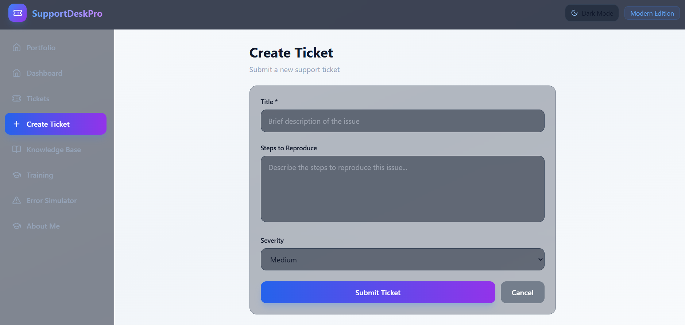
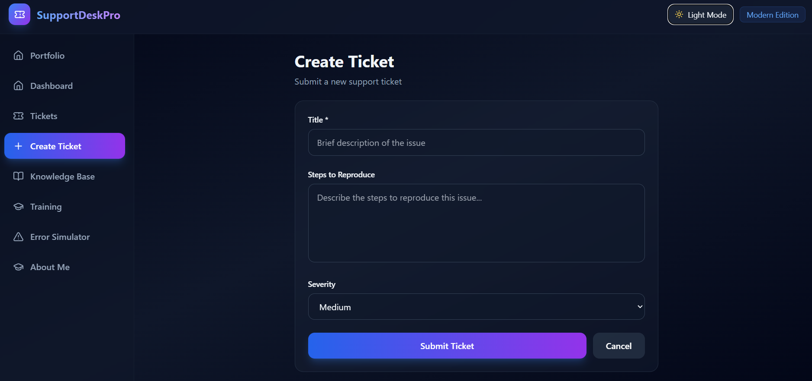
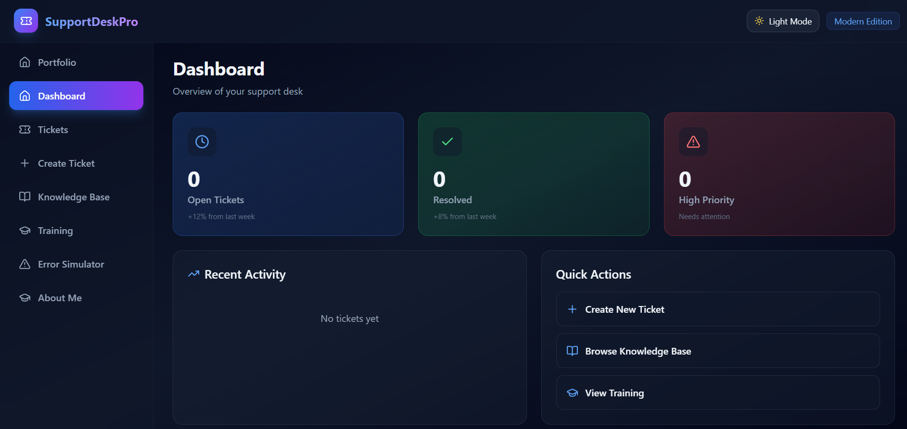
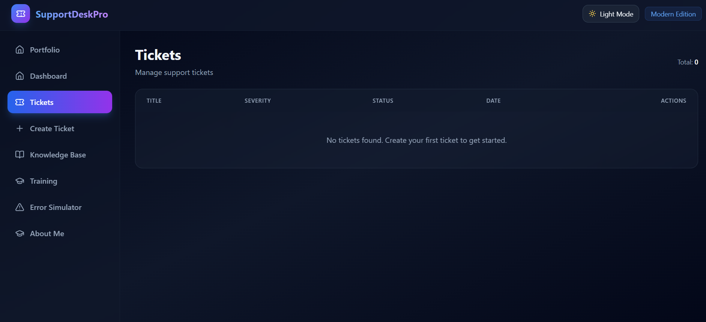
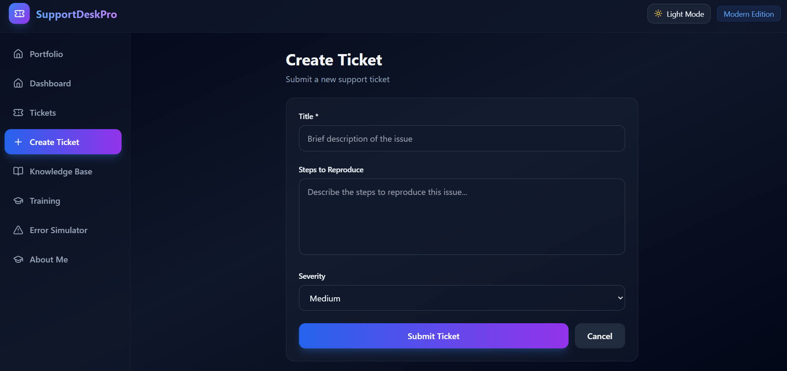
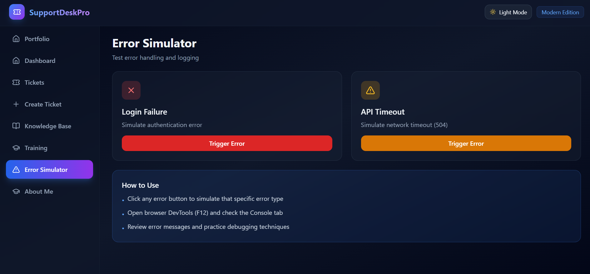
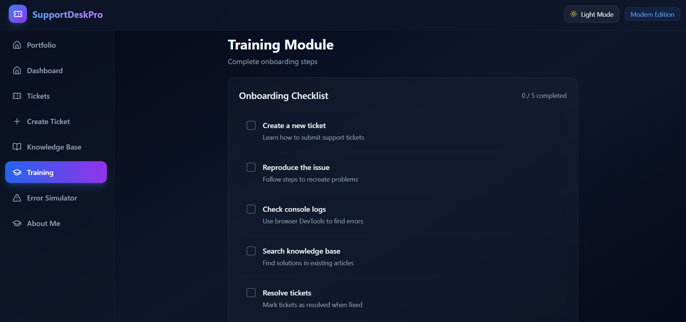
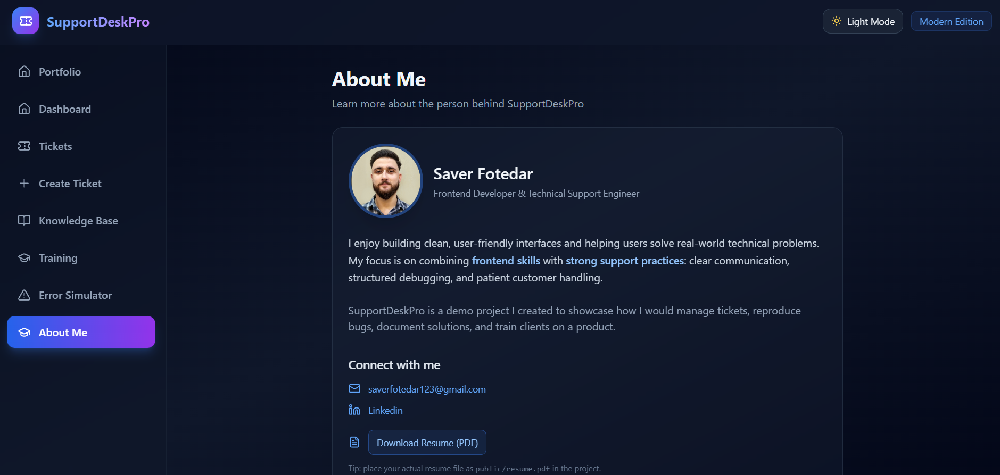

<div align="center">

# 💼 SupportDeskPro — Modern Technical Support & Training System

A full-featured **Technical Support Dashboard** built with **React + Vite + Tailwind CSS**, showcasing real-world support operations including **ticket lifecycle management, debugging workflows, client training & knowledge base** documentation.

---

### 🌍 Live Demo  
[](https://support-desk-pro.vercel.app)

### 📦 GitHub Repository  
[](https://github.com/Saver-Fotedar/SupportDeskPro_)

---

## 🎛 UI Themes
| Light Mode | Dark Mode |
|-----------|------------|
 | 

---

## 🛠 Tech Stack


---

## 🏷 Badges


</div>

---

# 📘 Project Overview

SupportDeskPro is a professional training and support simulation platform that demonstrates how to handle:
- 📝 Ticket lifecycle & prioritization  
- 🎓 Client onboarding & training guidance  
- 🐞 Debug reproduction via Error Simulator  
- 📚 Knowledge Base to reduce repeated tickets  
- 📊 Status & severity tracking  
- 💾 LocalStorage persistence for offline usability  

---

# 🖼 Application Screenshots

### 📌 Dashboard Overview


### 🎫 Ticket Management


### ➕ Create Ticket Form


### ❌ Error Simulator


### 🎓 Training Module


### 🧑 About Developer


---

# ✨ Key Features

### 📝 Ticket System
- Create, update & resolve support tickets
- Severity levels & prioritization
- Clean UX for professional workflow

### 🔧 Error Simulator
- API failure simulation
- Login failure mock
- Console debugging practice

### 📚 Know­ledge Base
- Troubleshooting articles & quick solutions

### 🎓 Training Section
- Client onboarding flow
- Stepwise usage tutorial

### 🙋 About & Resume Download
- Profile photo & professional summary
- Resume PDF download button

### 💾 Persistent Data
Stored in browser via LocalStorage

---

# 🚀 Getting Started (Setup)

```bash
git clone https://github.com/Saver-Fotedar/SupportDeskPro_.git
cd SupportDeskPro_
npm install
npm run dev
````

Your app will start at:
👉 `http://localhost:5173/`

---

# 📈 Future Enhancements

* Backend with Firebase / Express
* Role-based Authentication
* Analytics Dashboard (Admins)
* AI auto-response assistant
* File uploads for bug reporting
* PWA + mobile responsiveness upgrades

---

# 👨‍💻 Author

**Saver Fotedar**
Frontend Developer & Technical Support Engineer

📧 Email — [saverfotedar123@gmail.com](mailto:saverfotedar123@gmail.com)
🔗 LinkedIn — [https://linkedin.com/in/saver-fotedar-sf18/](https://linkedin.com/in/saver-fotedar-sf18/)
🌍 Portfolio — *Coming soon*

<div align="center">

### 💙 If you like this project, please ⭐ star the repository!

**It motivates me to build more!**

</div>
